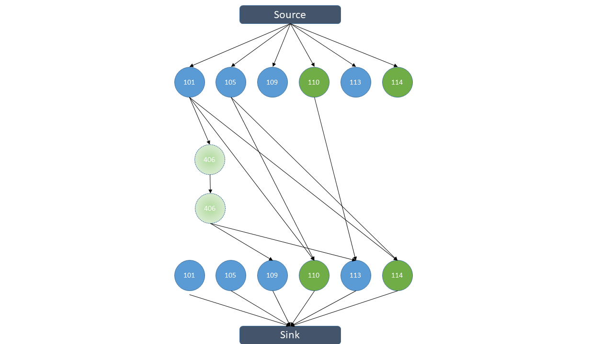

## About
This program calculates the number of train required to cover a given train service schedule.

Curious about [Taiwan High Speed Rail](https://www.thsrc.com.tw/index.html)'s trainset utilization rate, I decided to write a program to solve this question.
## Usage
### Program usage
#### Given Service timetable and a list of possible positioning trains
```bash
python3 main.py <service-timetable> <positioning-train-library>
```
- [*service-timetable*](#service-timetable): file name of a timetable located in ```data/``` folder
- [*positioning-train-library*](#positioning-train-library): file name of a list of all possible positioning trains, located in ```data/``` folder.

The alogrithm will choose a set of trains from the positioning train list to minimize the required train sets to cover the whole service timetable.
#### Given Service timetable, without positioning train list
```bash
python3 approxmain.py <service-timetable>
```
Without a specified list of possible positioning trains, the algorith assumes that a trainset can be positioned anytime within the following times:
- Nangang ⇄ Taichung: 60 minutes
- Taichung ⇄ Zuoying: 50 minutes
### Data file format
#### service timetable
Each line consists a train with the format:\
```<train number> <origin-station> <origin-time> <destination> <destination-time>```\
e.g: ```1202 ZUY 06:30 NAG 08:20```
#### positioning train library:
Each line consists a positioning train with the format:\
```<train number> <origin-station> <origin-time> <destination> <destination-time> <conflict-trains>```\
e.g: ```1455 NAG 20:30 TAC 21:30 1557```

*conflict-trains* is a list of conflicting service trains (specified by train number, seperated by space), , the algorithm will avoid selecting this positioning train when the service trains list contains a train in conflict.

**Tip:** To get better results, Split Nangang ⇄ Zuoying positioning trains into two legs, Nangang ⇄ Taichung and Taichung ⇄ Zuying, respectively. Leave it to the algorithm to decide whether to position a trainset all the way back to Nangang/Zuoying or just to Taichung. 

### Utility scripts
#### Timetable crawler
A script to crawl the timetable down from THSR's website.\
(Requires python3.6 and pipenv)

```bash
pipenv --python 3.6
pipenv install
pipenv shell
python timetable-crawler.py <YYYYMMDD>
```
### Train generator
A interactive script for generating train schedule list (Helpful for generating positioning train lists for peroidic timetables)

```bash
python3 train-generator.py
```
## Fun facts
THSR currently has 34 trainsets.

Statistics obtain from this program (without specifying the positioning train list):
#### Normal timetable (2018.10.8 -)

| Day        | utilaztion    |
|------------|---------------|
| Mon        | 28 trainsets  |
| Tue-Thu    | 27 trainsets  |
| Fri-Sun    | 30 trainsets  |

#### 2019 Chinese new year (2019.01.31 - 2019.02.11)
| Date       | utilaztion    |
|------------|---------------|
| 1/31       | 29 trainsets  |
| 2/1        | 32 trainsets  |
| 2/2 - 2/4  | 31 trainsets  |
| 2/5        | 32 trainsets  |
| 2/6 - 2/10 | 33 trainsets  |
| 2/11       | 30 trainsets  |

## Algorithm
The algorithm is an extension of [this problem](https://code.google.com/codejam/contest/dashboard?c=204113#s=a&a=2), which can be transformed into the Bipartite Maching Prblem, and then the Maximum Flow Problem, and be solved by the [Ford-Fulkerson Algorithm](https://en.wikipedia.org/wiki/Ford%E2%80%93Fulkerson_algorithm).

For the [Given Service timetable, without positioning train list](#given-service-timetable-without-positioning-train-list) version, It is exactly that codejam problem.

Construct a directed graph with each node representing a train service. Add a directed edge between two nodes if both trains can be assigned to the same trainset (Whether the terminus of the first train equals the origin of the second train and the second train departs after the first train ends its journey, or they share different terminus/origins but there's plenty of time for the trainset to be positioned to the origin of the second train).

The [Given Service timetable and a list of possible positioning trains](#given-service-timetable-and-a-list-of-possible-positioning-trains) version, however, requires some modification since some nodes(positioning trains) are optional.

Consider this timetable:

| train no. | origin   | depart time | destination | arrival time | type       |
|-----------|----------|-------------|-------------|--------------|------------|
| 101       | A        | 8           | B           | 9            | Service    |
| 105       | A        | 9           | B           | 10           | Service    |
| 406       | B        | 9           | A           | 10           | Positioning|
| 109       | A        | 10          | B           | 11           | YES        |
| 110       | B        | 10          | A           | 11           | YES        |
| 113       | A        | 11          | B           | 12           | YES        |
| 114       | B        | 11          | A           | 12           | YES        |

In the maximum flow problem, add those optional nodes in the middle (without connection to the source or sink) as follows:

## Useful resources
